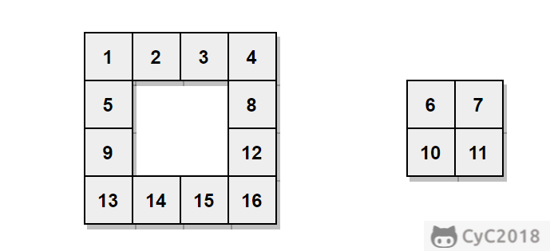

# 29. 顺时针打印矩阵

## 题目链接

[牛客网](https://www.nowcoder.com/practice/9b4c81a02cd34f76be2659fa0d54342a?tpId=13&tqId=11172&tPage=1&rp=1&ru=/ta/coding-interviews&qru=/ta/coding-interviews/question-ranking&from=cyc_github)

## 题目描述

按顺时针的方向，从外到里打印矩阵的值。下图的矩阵打印结果为：1, 2, 3, 4, 8, 12, 16, 15, 14, 13, 9, 5, 6, 7, 11, 10


## 解题思路

一层一层从外到里打印，观察可知每一层打印都有相同的处理步骤，唯一不同的是上下左右的边界不同了。因此使用四个变量 r1, r2, c1, c2 分别存储上下左右边界值，从而定义当前最外层。打印当前最外层的顺序：从左到右打印最上一行-\>从上到下打印最右一行-\>从右到左打印最下一行-\>从下到上打印最左一行。应当注意只有在 r1 != r2 时才打印最下一行，也就是在当前最外层的行数大于 1 时才打印最下一行，这是因为当前最外层只有一行时，继续打印最下一行，会导致重复打印。打印最左一行也要做同样处理。



```java
public ArrayList<Integer> printMatrix(int[][] matrix) {
    ArrayList<Integer> ret = new ArrayList<>();
    int r1 = 0, r2 = matrix.length - 1, c1 = 0, c2 = matrix[0].length - 1;
    while (r1 <= r2 && c1 <= c2) {
        // 上
        for (int i = c1; i <= c2; i++)
            ret.add(matrix[r1][i]);
        // 右
        for (int i = r1 + 1; i <= r2; i++)
            ret.add(matrix[i][c2]);
        if (r1 != r2)
            // 下
            for (int i = c2 - 1; i >= c1; i--)
                ret.add(matrix[r2][i]);
        if (c1 != c2)
            // 左
            for (int i = r2 - 1; i > r1; i--)
                ret.add(matrix[i][c1]);
        r1++; r2--; c1++; c2--;
    }
    return ret;
}
```
