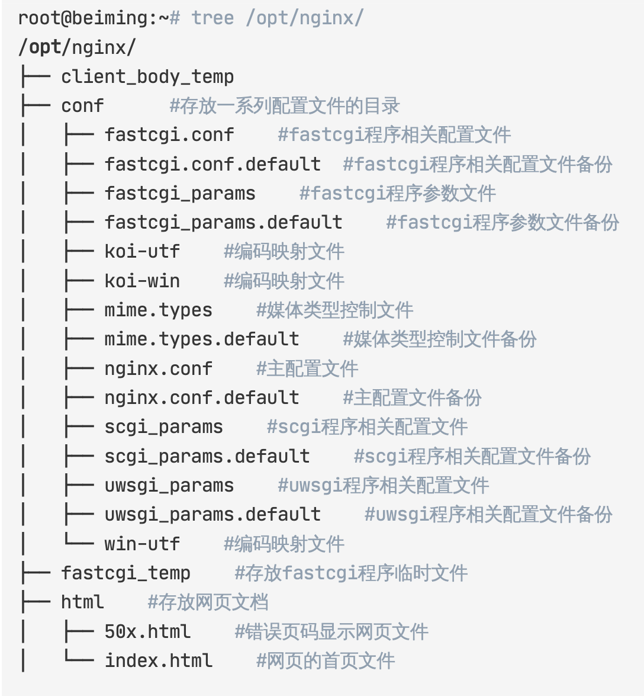
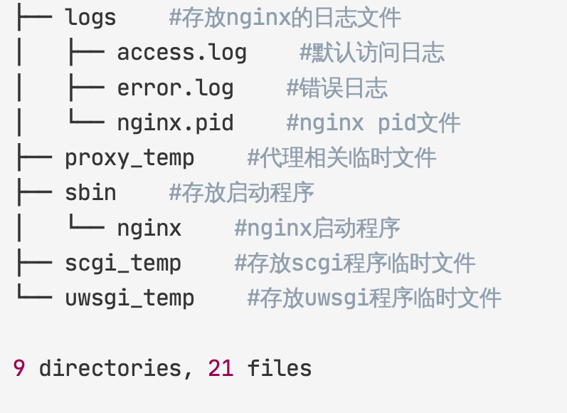

## Nginx介绍篇
Nginx 是异步框架的网页服务器，也可以用作反向代理、负载平衡器和 HTTP 缓存。该软件由俄罗斯程序员伊戈尔． 赛索耶夫开发并于 2004 年首次公开发布。2011年成立同名公司以提供支持服务。2019年3月11日，Nginx 公司被 F5网络公司以6.7 亿美元收购。Nginx 是免费的开源软件，根据类 BSD 许可证的条款发布。
## Nginx 优点

高并发支持单机能够支持10W+ 的并发连接（取决于内存大小，极限能够到百万），那么在实际生产中也是非常能接近这个数字的，这主要得益于 nginx 在linux 环境下使用了 epoll lO 多路复用模型。

内存消耗低在同类型 web 服务中，nginx 比 apache 占用的内存资源更少，在一般情况下10K 非活跃的 HTTP Keep-Alive 连接在 nginx 中仅消耗 2.5M 内存。

高扩展性低耦合的模块设计， 并且有丰富的第三方模块支持。

高可靠性经过十几年各种复杂场景和各大公司的生产环境验证，并且 nginx 的架构是由 master 进程和 worker 进程组成的，如果 worker 进程出现问题，那么 master 进程可以快速开启一个新的 worker 进程提供服务。

主流 Web 服务器市场占有率对比


## Nginx 全局命令介绍
查看当前 nginx 版本
```
nginx -V

#返回

nginx version: nginx/1.18.0 （Ubuntu）
```
检查配置文件是否正确
```
nginx -t

# 成功见如下

nginx: the configuration file Vetc/nginx/nginx. conf syntax is ok nginx: configuration file /etc/nginx/nginx.conf test is successful
```
重载配置文件
```
nginx -s reload
```
快速关闭
```
nginx -s stop
```
优雅关闭
```
nginx -S quit
```
重新打开日志文件
```
nginx -s reopen
```
通过系统信号进行停机

工作方式是通过获取 Nginx 的主进程号，然后通过 kill 命令进行停止 Nginx
获取 Nginx 的PID

如下可以看到进程信息分为 master process 和 worker process，前者代表主进程后者代表的是工作进程
```
＃ 获取NginxPID号

ps -eflgrep nginx

#二二========效果如下图=====

root 508258 1 0 11:11 n

www-data 508260 508258 0 11:11 n www-data 508261 508258 0 11:11 ？

www-data 508262 508258 11:11 ？

www-data 508263 508258 11:11？

root 572099 506069 12:19 pts/10

00:00:00 nginx: master process 00:00:00 nginx： worker process 00:00:00 nginx： worker process 00 :00:00 nginx: worker process 00 :00:00 nginx: worker process 00:00:00 grep --coLor=auto nginx
```
还有一种方式就是直接访问 / run/nginx.pid 文件获取 PID号。

优雅停机
```
kill -quit /run/nginx.pid*

kill -quit （输入nginx主进程号）
```
快速停机
```
kill -term /run/nginx.pid

kill -term （输入nginx主进程号）
#或者
kill -int /run/nginx.pid

kill -int （输入nginx主进程号）
```
强制停机
```
kill -9 /run/nginx.pid kill -9 （输入nginx主进程号） # 或者

pKill -9 nginx
```
平滑重启

当 Nginx 接收到 HUP 信号时，它会尝试先解析配置文件（如果指定配置文件，就使用指定的，否则使用默认的），如果成功，就应用新的配置文件（例如，重新打开日志文件或监听的套接字）。之后，Nginx 运行新的工作进程并从容关闭旧的工作进程。通知工作进程关闭监听套接字，但是继续为当前连接的客户提供服务。所有客户端的服务完

成后，旧的工作进程被关闭。如果新的配置文件应用失败，Nginx 将继续使用旧的配置进行工作。
```
kill -hup `/run/nginx.pid`
kill -hup（输入nginx主进程号）
```

Nginx 目录文件＆配置文件讲解


```bash
#user nobody；

worker_processes

//定义执行nginx程序的用户

1 #指定nginx进程数

#错误日志定义类型有：debug、 info、 notice、 warn、 error、 crit

#error_Log Logs/error. Log； //指定错误日志目录 #enror_Log Logs /error. Log notice；

#error_Log Logs/error. Log #worker_rLimit_nofile 1024；

info；

//指定notice类型的错误日志目录 //指定全局错误日志目录

#pid Logs /nginx.pid；

//指定但进程最多打开文件数量

//指定进程文件的目录

events ｛ #事件区块

#事件模型有：kqueue、 rtsig、 epoll、 / dev/polL, seLect、 poll

use epoll； #指指定参考事件模型

worker_connections

｝

1024； #指定单进程最大链接数

http ｛ #http区块

include mime. types； #指定nginx支持的媒体类型

default_type appLication/octet-stream； #指定默认的媒体类型

#指定日志记录格式

#Log_format main

#

$remote_addr - $remote_user ［$time_LocaL］ "$request

‡

$status $body_bytes_sent "$http_referen" I "$http_user_agent""$http_x_forwarded_for"'；
#access_Log Logs /access. 1og main； //指定nginx的访问日志目录

sendfile on #开启高效的传输模式
```
