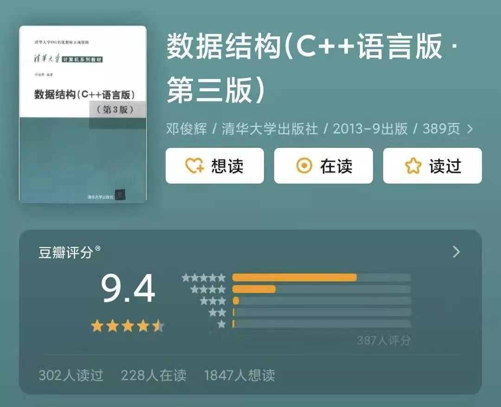
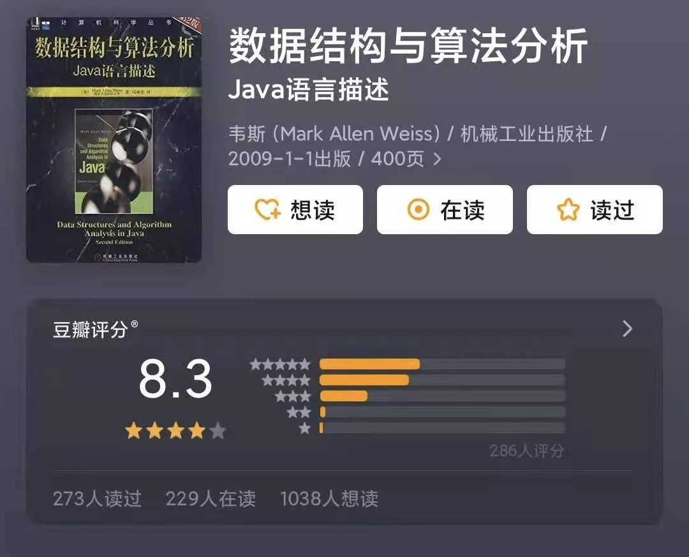
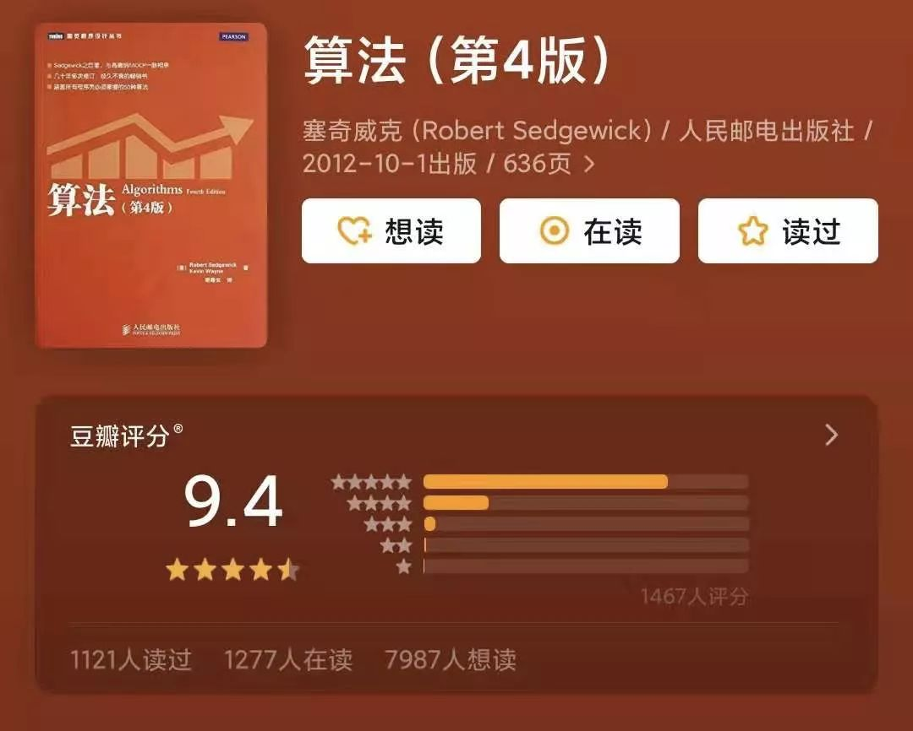

## 一、清华大学在 GitHub 上的开源课程

>地址：https://github.com/PKUanonym/REKCARC-TSC-UHT


我来带小伙伴们过一下清华的课程安排哈，主要是针对计算机专业的。

大一上的计算机基础课程有：计算机科学导论、程序设计基础

大一下有：面向对象程序设计基础

大二上有：数据结构

大二下有：人工智能导论、计算机图形学基础、高性能计算导论

大三上有：计算机组成原理、计算机网络原理、编译原理、软件工程、数据库系统概论、人工神经网络、计算机网络安全技术、人机交互理论与技术

大三下有：操作系统、计算机系统结构、机器学习概论、数据挖掘、搜索引擎技术基础、存储技术基础、数据库专题训练、计算机网络专题训练。

大四主要是实践、实习、毕设等，剩下的计算机课程主要有网络安全工程与实践、嵌入式系统。

可以看得出，大一大二基本上是在摸鱼状态，大三突然开始发力，各种计算机基础课程，非常疯狂！

不过：

有志者事竟成，破釜沉舟，百二秦关终属楚；<br>
苦心人天不负，卧薪尝胆，三千越甲可吞吴！

## 二、学习 C语言

**推荐一本书，两门视频课**。

书是电子书，书名叫《阮一峰的 C语言入门课》，我第一时间就拜读了一遍，受益匪浅！可以说目前我见到的最好的 C语言入门教程了，没有之一！国内的绝大多数高校，大一都会安排 C 语言这门课，阮一峰了老师的这份《C语言入门教程》，绝对是福音。

视频课是浙江大学翁恺教授的，一门《C语言程序设计入门》，一门《C语言程序设计进阶》。

学完这些，大家至少能学会下面这幅思维导图中列出来的内容。


[大一新生应该如何学习C语言，书上代码看不懂理解不了怎么办？](https://mp.weixin.qq.com/s/cZq24FJto2gJYWVhbhNBnQ)

## 三、学习数据结构

什么是数据结构？

>数据结构是一种具有一定逻辑关系，在计算机中应用某种存储结构，并且封装了相应操作的数据元素集合。它包含三方面的内容，逻辑关系、存储关系及操作。不同种类的数据结构适合于不同种类的应用，而部分甚至专门用于特定的作业任务。例如，计算机网络依赖于路由表运作，B 树高度适用于数据库的封装。

菜鸟教程上对数据结构的定义我觉得还是蛮正式（官方）的，说人话就是，**数据结构就是把一堆数据，按照某种格式揉成一坨**。

大家喜欢吃宫保鸡丁吗？

反正我挺喜欢这道菜的。我就以宫保鸡丁为例，来讲一讲数据结构吧。维基百科上是这样定义的。


>宫保鸡丁（英语：Kung Pao chicken或Kung-Pao Chicken），又称宫爆鸡丁，呈糊辣荔枝味，源于黔菜、流传至鲁而后成于川菜的一道川味名菜。贵州、山东和四川三地对这道菜的做法不完全一样，称呼也有差异。贵州称为糊辣子鸡丁，山东则名为酱爆鸡丁，而四川是以宫保鸡丁为名的。


来，抽象下宫保鸡丁。

```c
struct KungPaoChicken {
  鸡肉 = []
  花生 = []
  葱段 = []
  花椒 = []
  辣椒 = []
}
```

这个结构体（struct 是 C 语言中的一个概念）就是一个自定义的数据结构，将很多不同的配料融合在了一起。对于计算机的数据结构来说，只不过是把这些配料换成了基本数据类型。

拿 Java 来举例，基本的数据类型有 int、char、double 这些，复杂点的有 String（引用数据类型），底层是 char 型的数组，而那些自定义的类型不过是对基本数据类型和引用类型的封装。

抽象完宫保鸡丁再来抽象一下二哥吧。

```java
class 二哥 {
  int age = 18;
  double 体重 =  65kg;
  
  void eat(宫保鸡丁) {
    体重 += 1kg;
  }
}
```

伪代码不是很严谨哈，大家理解这个意思就行了。

说到底，数据结构不过是一种抽象后的封装。像 Java，它之所以流行的一个很重要的原因，就是它提供了多种多样的、方便开发者调用的数据结构，比如说对数组的封装 ArrayList、对链表的封装 LinkedList、对哈希表的封装 HashMap、ConcurrentHashMap 等等。C 语言就没有这些，想用的话，就得自己封装。但 Java 和 C 语言的基本数据类型是一致的，int、float 这些都是相通的。

对于初学者来说，平常敲代码都是直接去调用数据结构的，是很少去想这些数据结构是怎么实现的。

当一个初学者向高级程序员迈进的时候，就必须得静下心来，去搞清楚 ArrayList 和 LinkedList 的内部实现，搞清楚之后就会明白，之所以它们在增删改查的时候性能上有差异，就是因为它们的内部使用了不同的数据结构所导致的。

有一说一，我在 2008 年刚学 Java 的那会，真的是不理解，为什么明明有了 ArrayList，Java 还要设计 LinkedList，不都是集合嘛！

害！

**数据结构为什么这么重要？**

我直接放大招吧，甩一段清华大学计算机系教授邓俊辉老师话吧。

> 数据结构是计算机科学的关键内容，也是构建高效算法的必要基础。其中涉及的知识，在相关专业的课程系统中始终处于核心位置。以 ACM/IEEE
> Computing
> Curricula（计算机教学大纲）为例，其中对于几个相关专业（计算机科学、计算机工程、信息系统、信息技术、软件工程）的共同要求中，数据结构与算法作为程序设计概念与技能的核心，紧随在数学之后，排在第二位。

数据结构说复杂也不复杂，说简单也不简单，这不重要，重要的是必须得学！

有小伙伴可能会问，“我数学学的不好，学数据结构能学会吗？”

说句实在话，数据结构和数学之间没有必然的关系。**我上小学的时候，参加过洛阳市的奥林匹克数学竞赛，还得了三等奖**（偷偷地加个粗）；初中的时候，数学成绩也一直保持得不错，但上了高中之后，由于贪玩，数学成绩一落千丈，成了瘸腿课。大学的时候对离散数学、微积分这些更是头大。

但这并不妨碍我学习数据结构，真的。数据结构中，树算是最难的一块了，像数组、链表、栈、哈希表这些相对来说，计算机专业的，只要稍微下点功夫，都是能掌握的。

说了这么多，**数据结构到底该怎么学呢？**

如果你有 C/C++ 的底子，我给推荐两本书。

第一本，《趣学数据结构》


说到这，多说一嘴。2018 年的时候，人民邮电出版社的张老师邀请我出一本 Java 方面的书，我当时想命名为《趣学 Java》。张老师说，刚好之前和陈小玉老师合作出了一本《趣学算法》的书，要不发一本你看看吧。

你别说，这本书还挺适合拿来作为算法的入门书呢。后来，陈小玉老师又出了一本新书，叫《趣学数据结构》，我看了，虽然离“趣”字有点距离，但很适合作为一门数据结构方面的入门书。

第二本，《数据结构（C++语言版）》


对，清华大学邓俊辉教授编著的，豆瓣评分也蛮高的。这本书还配套了视频课程，是免费的，可以在学堂在线上看，我之前也有推荐过。


课程质量木得说，算是国家级精品课了。大家有时间的话，一定要刷一遍。

>视频地址：https://www.xuetangx.com/course/THU08091000384/7755489

对了，还有浙江大学陈越姥姥的视频课：

>视频地址：https://www.bilibili.com/video/BV1JW411i731

如果你有 Java 的底子，我也给推荐两本书。

第一本，《数据结构与算法分析（Java 语言描述）》


虽然翻译得不怎么样，但内容很全面，适合拿来作为一本数据结构的入门书。

第二本，《算法（第 4 版）》


虽然名为算法，但大家都知道，算法是基于数据结构的，数组、队列、栈、堆、二叉树、哈希表等等，这些数据结构都讲到了。

如果时间比较紧的话，C/C++ 程序员只看《数据结构（C++语言版）》就行了，Java 程序员只看《算法（第 4 版）》就行了。如果一遍没看懂的话，再看一遍就好了。

有网友“三色院堇子的老公”说得好。

> 数据结构就是你已经写了几百万行，然后数据结构减到 90 万行，性能还翻倍，嗯，终于学会了！

## 四、走心总结

2022 年 1 月份，很有必要开个好头。

那么趁寒假刷一波清华在 GitHub 上的开源课程，还有 C语言和数据结构，寒假过后，绝壁是卷王中的卷王。

悄悄地告诉大家一声，很多说放假了一定要打打游戏，一定要放松下，这些人都在悄悄地卷。

所以说，如果你是正在放松的那个，可要小心了！

不要一个寒假就被甩开了差距。

工作党其实也一样，适当放松，时刻警惕，该学的时候还是要能支棱起来。
