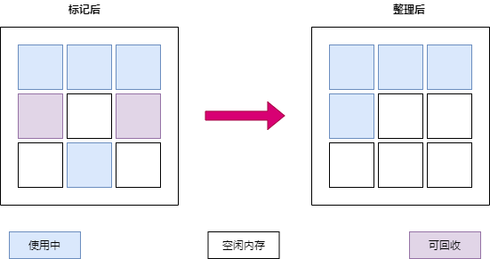
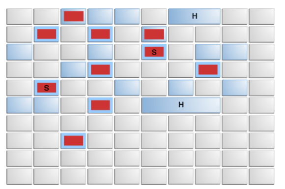
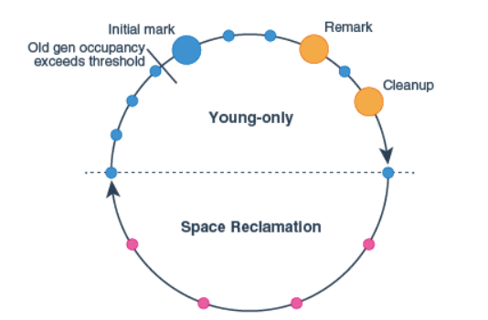

作为一款高效的垃圾收集器，G1在JDK7中加入JVM，在JDK9中取代CMS成为了默认的垃圾收集器。 

 

## 1 垃圾收集器回顾

### 1.1 新生代

新生代采用复制算法，主要的垃圾收集器有三个，Serial、Parallel New 和 Parallel Scavenge，特性如下：

*   Serial:单线程收集器，串行方式运行，GC 进行时，其他线程都会停止工作。在单核 CPU 下，收集效率最高。
*   Parallel New：Serial 的多线程版本，新生代默认收集器。在多核 CPU 下，效率更高，可以跟CMS收集器配合使用。
*   Parallel Scavenge：多线程收集器，更加注重吞吐量，适合交互少的任务，不能跟 CMS 配合使用。

### 1.1 老年代

*   Serial Old：采用标记-整理(压缩)算法，单线程收集。
*   Parallel Old：采用标记-整理(压缩)算法，可以跟 Parallel Scavenge 配合使用
*   CMS：Concurrent Mark Sweep，采用标记-清除算法，收集线程可以跟用户线程一起工作。

> CMS缺点：吞吐量低、无法处理浮动垃圾、标记清除算法会产生大量内存碎片、并发模式失败后会切到Serial old。

*   G1：把堆划分成多个大小相等的Region，新生代和老年代不再物理隔离，多核 CPU 和大内存的场景下有很好的性能。新生代使用复制算法，老年代使用标记-压缩(整理)算法。

 

 

## 2 G1介绍

### 2.1 初识G1

G1垃圾收集器主要用于多处理器、大内存的场景，它有五个属性：分代、增量、并行(大多时候可以并发)、stop the word、标记整理。

*   分代：跟其他垃圾收集器一样，G1把堆分成了年轻代和老年代，垃圾收集主要在年轻代，并且年轻代回收效率最高。偶尔也会在老年代进行回收。
*   增量：为了让垃圾收集时STW时间更短，G1采用增量和分步进行回收。G1通过对应用之前的行为和停顿时间进行分析构建出可预测停顿时间模型，并且利用这个信息来预测停顿时间内的垃圾收集情况。比如：G1会首先回收那些收集效率高的内存区域(这些区域大部分空间是可回收垃圾，这也是为啥叫G1的原因）。
*   并行和并发：为了提高吞吐量，一些操作需要STW。一些需要花费很多时间的操作，比如整堆操作(像全局标记)**可以并发执行，同时可以并发跟应用并行执行**。
*   标记整理：G1主要使用标记整理算法来进行垃圾收集，标记阶段跟“标记清除”算法一样，但标记之后不会直接对可回收对象进⾏清理，⽽是让所有存活对象都移动到一端，然后直接回收掉移动之后边界以外的内存。如下图：

      我们知道，垃圾收集器的一个目标就是STW(stop the word)越短越好。利用可预测停顿时间模型，G1为垃圾收集设定一个STW的目标时间(通过 -XX:MaxGCPauseMillis 参数设定，默认200ms)，G1尽可能地在这个时间内完成垃圾收集，并且在不需要额外配置的情况下实现高吞吐量。

G1致力于在下面的应用和环境下寻找延迟和吞吐量的最佳平衡：

*   堆大小达到10GB以上，并且一半以上的空间被存活的对象占用
*   随着系统长期运行，对象分配和升级速率变化很快
*   堆中存在大量内存碎片
*   垃圾收集时停顿时间不能超过几百毫秒，避免垃圾收集造成的长时间停顿。

如果在JDK8中使用G1，我们可以使用参数 -XX:+UseG1GC 来开启。

> G1并不是一款实时收集器，它尽最大努力以高性能完成 MaxGCPauseMillis 设置的停顿时间，但并不能绝对保证在这个时间内完成收集。

### 2.2 堆布局

G1把整个堆分成了大小相等的region，每一个region都是连续的虚拟内存，region是内存分配和回收的基本单位。如下图：

红色带"S"的region表示新生代的survivor，红色不带"S"的表示新生代eden，浅蓝色不带"H"的表示老年代，浅蓝色带"H"的表示老年代中的大对象。跟G1之前的内存分配策略不同的是，survivor、eden、老年代这些区域可能是不连续的。

G1在停顿的时候可以回收整个新生代的region，新生代region的对象要不复制到survivor区要不复制到老年代region。同时每次停顿都可以回收一部分老年代的内存，把老年代从一个region复制到另一个region。

### 2.3 关于region

上一节我们看到，整个堆内存被G1分成了多个大小相等的region，每个堆大约可以有2048个region，每个region大小为 1~32 MB(必须是2的次方)。region的大小通过 -XX:G1HeapRegionSize 来设置，所以按照默认值来G1能管理的最大内存大约 32MB \* 2048 = 64G。

### 2.4 大对象

大对象是指大小超过了region一半的对象，大对象可以横跨多个region，给大对象分配内存的时候会直接分配在老年代，并不会分配在eden区。

如下图，一个大对象占据了两个半region，给大对象分配内存时，必须从一个region开始分配连续的region，在大对象被回收前，最后一个region不能被分配给其他对象。

**大对象什么时候回收**？通常，只有在mark结束以后的Cleanup停顿阶段或者FullGC的时候，死亡的大对象才会被回收掉。但是，基本类型(比如bool数组、所有的整形数组、浮点型数组等)的数组大对象有个例外,G1会在任何GC停顿的时候回收这些死亡大对象。这个默认是开启的，但是可以使用 -XX:G1EagerReclaimHumongousObjects 这个参数禁用掉。

分配大对象的时候，因为占用空间太大，可能会过早发生GC停顿。G1在每次分配大对象的时候都会去检查当前堆内存占用是否超过初始堆占用阈值IHOP(The Initiating Heap Occupancy Percent)，如果当前的堆占用率超过了IHOP阈值，就会立刻触发 initial mark。**关于initial mark详见第4节**。

即使是在FullGC的时候，大对象也是永远不会被移动的。这可能导致过早发生FullGC或者是意外的OOM，因为此时虽然还有大量的空闲内存，但是这些内存都是region中的内存碎片。

## 3 内存分配

G1虽然把堆内存划分成了多个region，但是依然存在新生代和老年代的概念。G1新增了2个控制新生代内存大小的参数，-XX:G1NewSizePercent(默认等于5)，-XX:G1MaxNewSizePercent(默认等于60)。也就是说新生代大小默认占整个堆内存的 5% ~ 60%。

根据前面介绍，一个堆大概可以分配2048个region，每个region最大32M，这样G1管理的整个堆的大小最大可以是64G，新生代占用的大小范围是 3.2G ~ 38.4G。

对于 -XX:G1NewSizePercent 和 -XX:G1MaxNewSizePercent，下面几个问题需要注意：

1.  **如果设置了-Xmn，那这两个参数是否生效？**

生效，比如堆大小是64G，设置 -Xmn3.2G，那么就等价于 -XX:G1NewSizePercent=5 并且 -XX:G1MaxNewSizePercent=5，因为3.2G/64G = 5%。

2.  **如果设置了 -XX:NewRatio，这两个参数是否生效？**

生效，比如堆大小是64G，设置 -XX:NewRatio=3，那么就等价于 -XX:G1NewSizePercent=25 并且 -XX:G1MaxNewSizePercent=25。因为年轻代：老年代 = 1 ：3，说明年轻代占1/4 = 25%。

3.  **如果 -XX:G1NewSizePercent 和 -XX:G1MaxNewSizePercent 只设置其中一个，那这两个参数还生效吗？**

设置的这个参数不生效，两个参数都用默认值。

4.  **如果-XX:G1NewSizePercent 和 -XX:G1MaxNewSizePercent 这两个参数都生效了，什么时候动态扩容？**

跟 -XX:GCTimeRatio 这个参数相关。这个参数为0~100之间的整数(G1默认是9, 其它收集器默认是99)，值为 n 则系统将花费不超过 1/(1+n) 的时间用于垃圾收集。因此G1默认最多 10% 的时间用于垃圾收集，如果垃圾收集时间超过10%，则触发扩容。如果扩容失败，则发起Full GC。

## 4 垃圾回收

G1的垃圾收集是在 Young-Only 和 Space-Reclamation两个阶段交替执行的。如下图：

young-only阶段会用对象逐步把老年代区域填满，space-reclamation阶段除了会回收年轻代的内存以外，还会增量回收老年代的内存。完成后重新开始young-only阶段。

### 4.1 Young-only

Young-only阶段流程如下图：

这个阶段从普通的 young-only GC 开始，young-only GC把一些对象移动到老年代，当老年代的空间占用达到IHOP时，G1就停止普通的young-only GC，开始初始标记(Initial Mark)。

*   初始标记：这个过程除了普通的 young-only GC 外，还会开始并发标记过程，这个过程决定了被标记的老年代存活对象在下一次space-reclamation阶段会被保留。这个过程不会STW，有可能标记还没有结束普通的 young-only GC 就开始了。这个标记过程需要在重新标记(Remark)和清理(Cleanup)两个过程后才能结束。
*   重新标记: 这个过程会STW，这个过程做全局引用和类卸载。

在重新标记和清理这两个阶段之间G1会并发计算对象存活信息，这个信息用于清理阶段更新内部数据结构。
*   清理阶段：

这个节点回收所有的空闲区域，并且决定是否接着执行一次space-reclamation，如果是，则仅仅执行一次单独的young-only GC，young-only阶段就结束了。

> 关于IHOP，默认情况下，G1会观察标记周期内标记花了多少时间，老年代分配了多少内存，以此来自动确定一个最佳的IHOP，这叫做自适应IHOP。如果开启这个功能，因为初始时没有足够的观察数据来确定IHOP，G1会用参数 -XX:InitiatingHeapOccupancyPercent 来指定初始IHOP。可以用 -XX:-G1UseAdaptiveIHOP 参数关闭自适应IHOP，这样IHOP就参数 -XX:InitiatingHeapOccupancyPercent 指定的固定值。自适应IHOP这样设置老年代占有率,当老年代占有率=老年代最大占有率 - 参数 -XX:G1HeapReservePercent 值时，启动space-reclamation阶段的第一个Mixed GC。这里参数 -XX:G1HeapReservePercent 作为一个额外的缓存值。

> 关于标记，标记使用 SATB 算法，初始标记开始时，G1保存堆的一份虚拟镜像，这份镜像存活的对象在后续的标记过程中也被认为是存活的。这有一个问题，就是标记过程中如果部分对象死亡了，对于 space-reclamation 阶段来说它们仍然是存活的(也有少部分例外)。跟其他垃圾收集器相比，这会导致一部分死亡对象被错误保留，但是为标记阶段提供了更好的吞吐量，而且这些错误保留的对象会在下一次标记阶段被回收。

在young-only阶段，要回收新生代的region。每一次 young-only 结束的时候，G1总是会调整新生代大小。G1可以使用参数 -XX:MaxGCPauseTimeMillis和 -XX:PauseTimeIntervalMillis 来设置目标停顿时间，这两个参数是对实际停顿时间的长期观察得来的。他会根据在GC的时候要拷贝多少个对象，对象之间是如何相互关联的等信息计算出来回收相同大小的新生代内存需要花费多少时间，

如果没有其他的限定条件，G1会把young区的大小调整为 -XX:G1NewSizePercent和 -XX:G1MaxNewSizePercent 之间的值来满足停顿时间的要求。

### 4.2 Space-reclamation

这个阶段由多个Mixed GC组成，不光回收年轻代垃圾，也回收老年代垃圾。当 G1 发现回收更多的老年代区域不能释放更多空闲空间时，这个阶段结束。之后，周期性地再次开启一个新的Young-only阶段。

当G1收集存活对象信息时内存不足，G1会做一个Full GC，并且会STW。

在 space-reclamation 阶段，G1会尽量在GC停顿时间内回收尽可能多的老年代内存。这个阶段新生代内存大小被调整为 -XX:G1NewSizePercent 设置的允许的最小值，只要存在可回收的老年代region就会被添加到回收集合中，直到再添加会超出目标停顿时间为止。在特定的某个GC停顿时间内，G1会按照这老年代region回收的效率(效率高的优先收集)和剩余可用时间来得到最终待回收region集合。

每一个GC停顿期间要回收的老年代region数量受限于候选region集合数量除以 -XX:G1MixedGCCountTarget 这个参数值，参数 -XX:G1MixedGCCountTarget 指定一个周期内触发Mixed GC最大次数，默认值8。比如 -XX:G1MixedGCCountTarget 采用默认值8，候选region集合有200个region，那每次停顿期间收集25个region。

> 候选region集合是老年代中所有占用率低于 -XX:G1MixedGCLiveThresholdPercent 的region。

当待回收region集合中可回收的空间占用率低于参数值 -XX:G1HeapWastePercent 的时候，Space-Reclamation结束。

### 4.3 内存紧张情况

当应用存活对象占用了大量内存，以至于回收剩余对象没有足够的空间拷贝时，就会触发 evacuation failure。这时G1为了完成当前的垃圾收集，会保留已经位于新的位置上的存活对象不动，对于没有移动和拷贝的对象就不会进行拷贝了，仅仅调整对象间的引用。

evacuation failure会导致一些额外的开销，但是一般会跟其他 young GC 一样快。evacuation failure完成以后，G1会跟正常情况下一样继续恢复应用的执行。G1会假设 evacuation failure是发生在GC的后期，这时大部分对象已经移动过了，并且已经有足够的内存来继续执行应用程序一直到 mark 结束 space-reclamation 开始。如果这个假设不成立(也就是说没有足够的内存来执行应用程序)，G1最终只能发起Full GC，对整个堆做压缩，这个过程可能会非常慢。

## 5 跟其他收集器比较

### 5.1 Parallel GC

Parallel GC 可以压缩和回收老年代的内存，但是也只能对老年代整体来操作。G1以增量的方式把整个GC工作增量的分散到多个更短的停顿时间中，当然这可能会牺牲一定吞吐量。

### 5.2 CMS

跟CMS类似，G1并发回收老年代内存，但是，CMS采用标记-清除算法，不会处理老年代的内存碎片，最终就会导致长时间的FullGC。

### 5.3 G1问题

因为采用并发收集，G1的性能开销会更大，这可能会影响吞吐量。

### 5.4 G1优势

G1在任何的GC期间都可以回收老年代中全空或者占用大空间的内存。这可以避免一些不必要的GC，因为可以非常轻易地释放大量的内存空间。这个功能默认开启，可以采用 -XX:-G1EagerReclaimHumongousObjects 参数关闭。

G1可以选择对整个堆里面的String进行并行去重。这个功能默认关闭，可以使用参数 -XX:+G1EnableStringDeduplication 来开启。

## 6 总结

本文详细介绍了G1垃圾收集器，希望能够对你理解G1有所帮助。

参考:

1.  https://docs.oracle.com/javase/10/gctuning/garbage-first-garbage-collector.htm#JSGCT-GUID-CE6F94B6-71AF-45D5-829E-DEADD9BA929D
2.  https://mp.weixin.qq.com/s/KkA3c2\_AX6feYPJRhnPOyQ

>参考链接：[https://mp.weixin.qq.com/s/rVS5TBRU9QcnMNdBz6w_Mg](https://mp.weixin.qq.com/s/rVS5TBRU9QcnMNdBz6w_Mg)，整理：沉默王二
