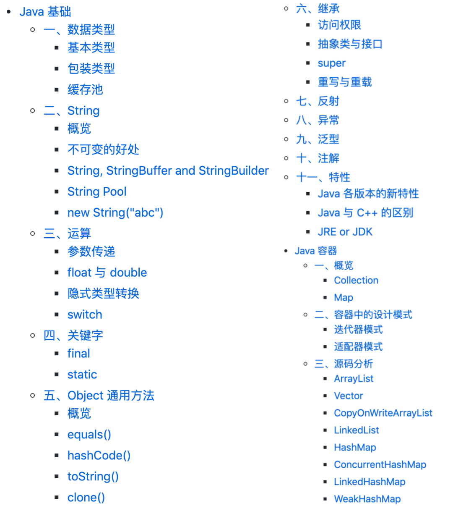
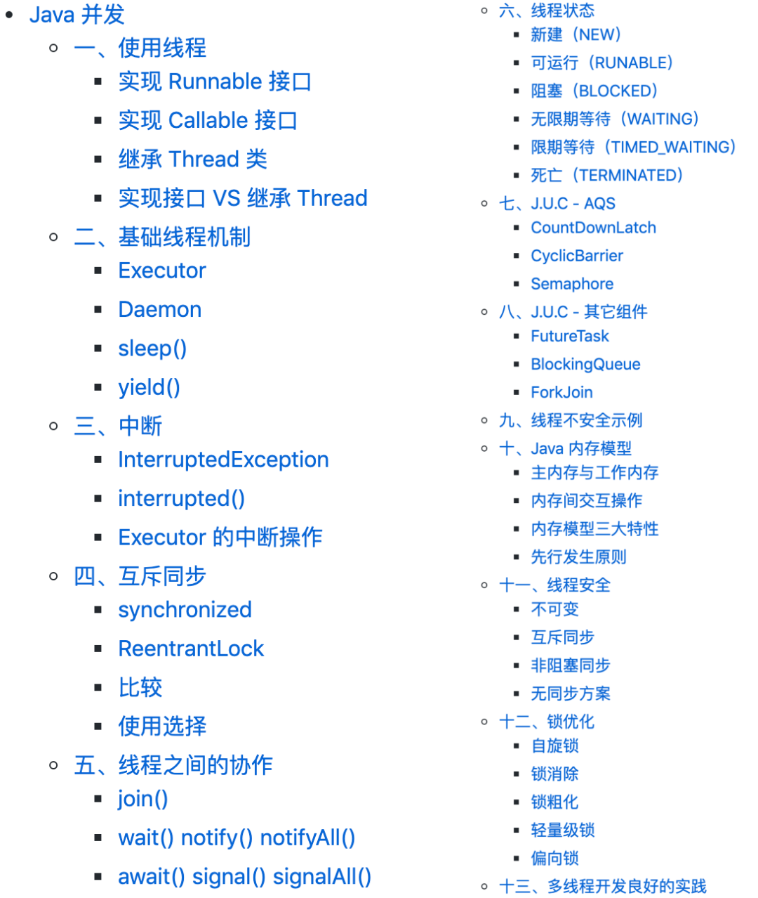
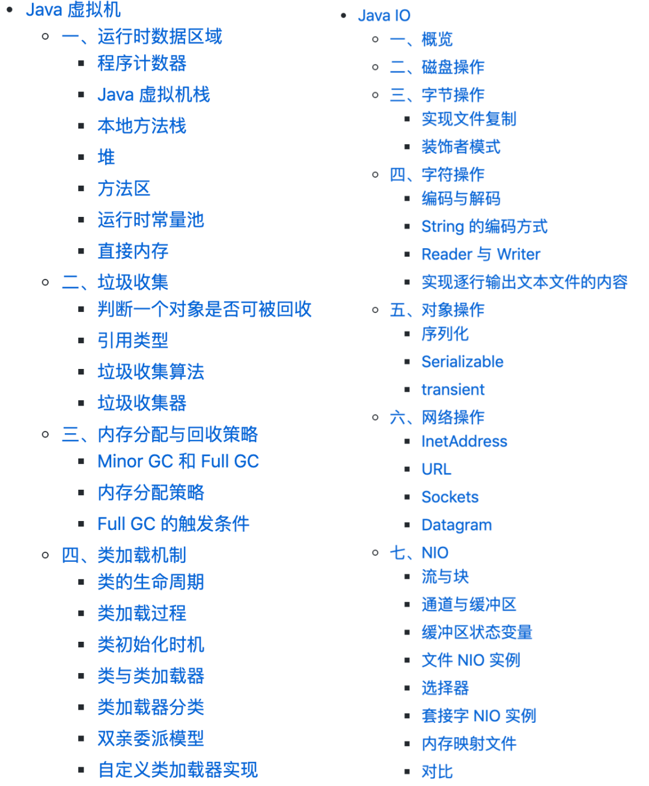

学 Java 其实不难，重要的是找到好的学习资料和学习方法，然后就是付诸实践。

我不太建议大家一上来就阅读《Java 核心技术卷》这些书，因为书太厚，对于初学者来说不是特别友好，如果没耐心可能就直接劝退了。我也不太建议大家一上来就去看视频，因为视频一般比较啰嗦，抓不住重点。

**大家先看看我整理的这份 GitHub 上星标 115k+ 的 Java 教程，里面涵盖了 Java 所有的知识点，包括 Java 语法、Java 集合框架、Java IO、Java 并发编程和 Java 虚拟机，内容不多，只讲重点**。

来看一下目录吧！

> [https://github.com/CyC2018/CS-Notes](https://github.com/CyC2018/CS-Notes)